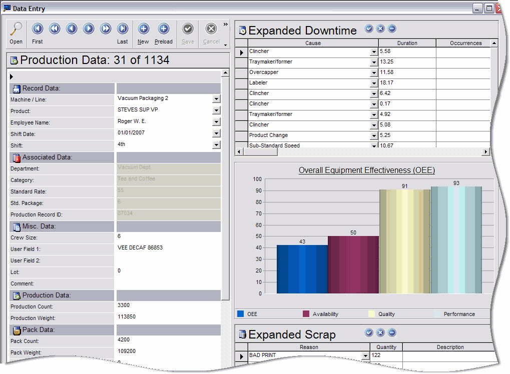
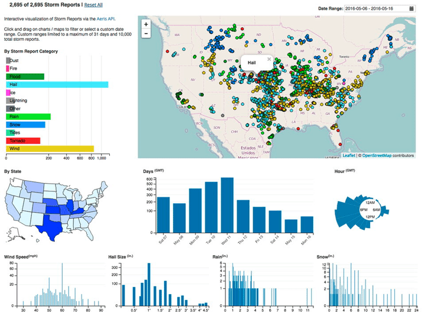
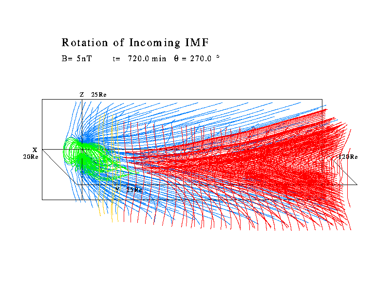
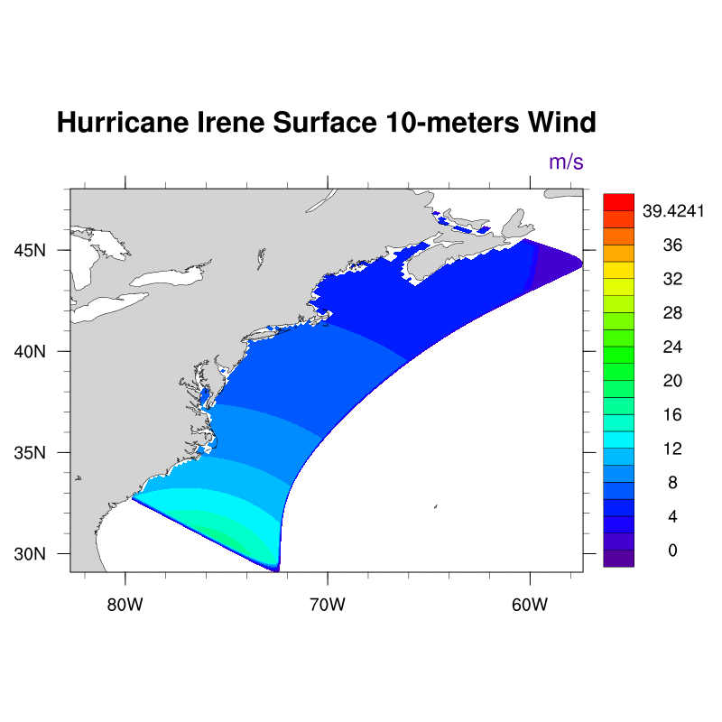
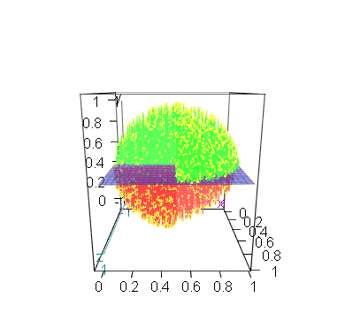
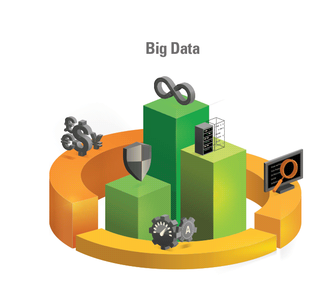
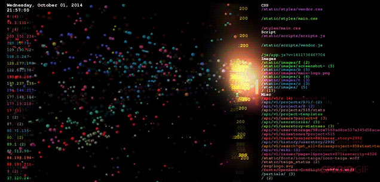

<!-- Snake Game Repo View -->

  
</td>
</tr>
</table>
<!-- ============================================================ -->
<!--  ABHISHEK JATAV — PROFESSIONAL GITHUB PROFILE README         -->
<!--  Theme: Corporate Navy & Steel Blue | Data Analytics Focus   -->
<!--  100% GitHub-safe: HTML + Markdown + SVG + Shields.io only   -->
<!--  Note: Skills progress bars are plain Unicode text (no       -->
<!--  external image service) so they can never break/show blank.-->
<!-- ============================================================ -->

<!-- Professional dark gray waving banner -->

<!-- Animated typing effect -->

  

<!-- Status badges -->

  

<!-- Social badges -->

<!-- Section divider -->

## 👨‍💼 About Me

<table>
<tr>
<td>

- 🔭 Currently working as a **Data Analyst Intern** at **Unified Mentor Pvt. Ltd.**
- 🛠️ Building real-world **Excel, SQL, Power BI, Tableau & Python** projects
- 📊 Focused on **business dashboards, BI reporting, and data storytelling**
- 🤝 Open to collaborate on **Data Analytics & Business Intelligence** projects
- 📚 Expanding Expertise in **Machine Learning & Advanced Data Analytics**
- 💬 Ask me about **Excel, SQL, Power BI, Tableau & Python**
- ⚡ Fun fact: I love transforming complex datasets into simple, interactive dashboards

## 🧰 Tech Stack

 

**Data & Analytics**

**Programming & ML**

**Cloud & Tools**

## 📊 Skills Proficiency
 

<!-- Text-based progress bars (Unicode blocks) — no external image
     service involved, so this section can never show as broken. -->

| Skill | Proficiency | Progress |
|---|:---:|---|
| Advanced Excel | 96% | `███████████████████░` |
| SQL | 92% | `██████████████████░░` |
| Power BI | 90% | `██████████████████░░` |
| Python | 88% | `█████████████████░░░` |
| Tableau | 84% | `████████████████░░░░` |
| Business Intelligence | 82% | `████████████████░░░░` |
| AWS | 75% | `███████████████░░░░░` |
| Machine Learning | 68% | `█████████████░░░░░░░` |

## 🚀 Featured Projects

| Project | Tools | Focus |
|---|---|---|
| **Sales Performance Dashboard** | Excel, SQL, Power BI | KPIs, regional trends, executive reporting |
| **Employee Analytics Report** | Python, Pandas, Tableau | Segmentation, repeat purchase, churn signals |
| **Machine Learning Starter Lab** | Python, NumPy, ML | Preprocessing, model comparison, evaluation |

## 🎓 Achievements & Learning Pate

| Milestone | Status |
|---|---|
| B.Tech Information Technology | ✅ Completed |
| Data Analyst Intern — Unified Mentor Pvt. Ltd. | 🟢 Ongoing |
| Advanced Excel & Power BI Projects | ✅ Completed |
| SQL & Database Analytics | ✅ Completed |
| Machine Learning Fundamentals | 🟡 In Progress |
| AWS Cloud for Data Analytics | 🟡 In Progress |

## 💭 Quote

> *"The only way to learn a new programming language is by writing programs in it."*
> — Dennis Ritchie

## 📬 Contact Me

**Profile Views:**

<!-- Professional animated wave footer -->

Professional Data Analytics GitHub Profile — Corporate Navy &amp; Steel Blue Theme

